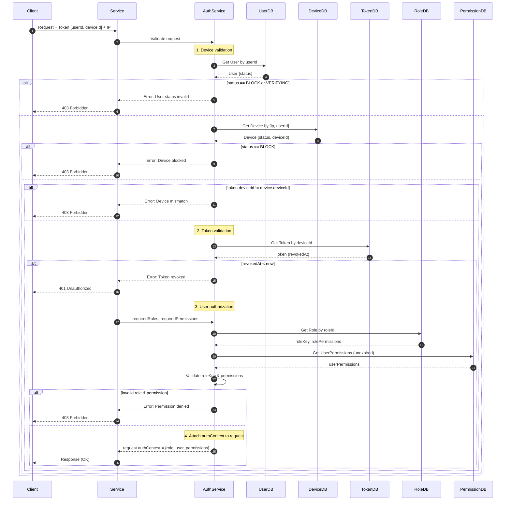

### Authorization flow

- Client sends request to service → token → `[userId, deviceId]` + `request IP`

---

### 1. Device validation

- `userId → User` → `status == "BLOCK", "VERIFYING"` → error
- `[ip, userId]` → `Device → {status, deviceId}`
- if `status == "BLOCK"` → error
- if `deviceId != deviceId (from token)` → error

---

### 2. Token validation

- `deviceId `→ `Token.revokedAt`
- if `revokedAt < Date.now()` → error

---

### 3. User authorization

- From Controller → `[requiredRoles, requiredPermissions]`
- `userId → User → roleId`
  - Compare `roleKey`:
    - `roleId → Role → roleKey == requiredRoles` → `validRoleKey = true`

  - Compare `permissions`:
    - `roleId → RolePermission → permissions (1)`
    - `userId → UserPermission (not expired) → permissions (2)`
    - `permissions(1 + 2) == requiredPermissions` → `validPermission = true`

---

### 4. Attach authorized context to request

- If `validRoleKey || validPermission`:

```ts
request.authContext = {
  role: roleKey,
  user: {...user},
  permissions: string[]
};
```

---

### 5. Resource ownership validation (inside controller code)

- Example: User who created a post has permission to edit or delete that post.

---

## Sequence Diagram


