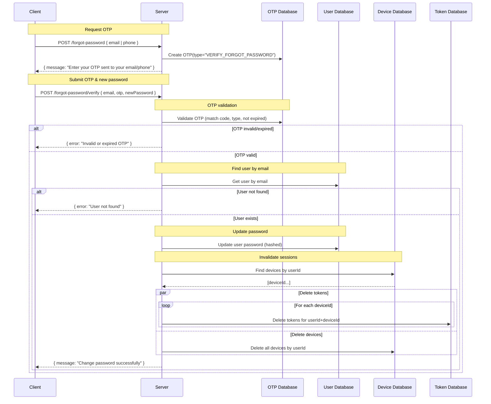

# Forgot Password

When a user forgets their password, the system provides a reset mechanism using OTP verification.
After the password is updated, all existing sessions and tokens are revoked.

---

### Request OTP

- Client selects method to receive OTP: **email** or **phone**
- Server generates an OTP with `type="VERIFY_FORGOT_PASSWORD"`
- Server responds:

```json
{ "message": "Enter your OTP sent to your email/phone" }
```

---

### Submit OTP and new password

- Client sends request: `{ email, otp, newPassword }`
- Server processing:
  - Validate OTP (must match, correct type, not expired)
  - Find user by email
    - If not found → return error

  - Hash the new password and update user record
  - Invalidate all user sessions:
    - Delete tokens for all devices
    - Delete devices associated with the user

- Server responds:

```json
{ "message": "Change password successfully" }
```

---

### Error Cases

- Invalid or expired OTP:

```json
{ "error": "Invalid or expired OTP" }
```

- User not found:

```json
{ "error": "User not found" }
```

---

## Sequence Diagram


