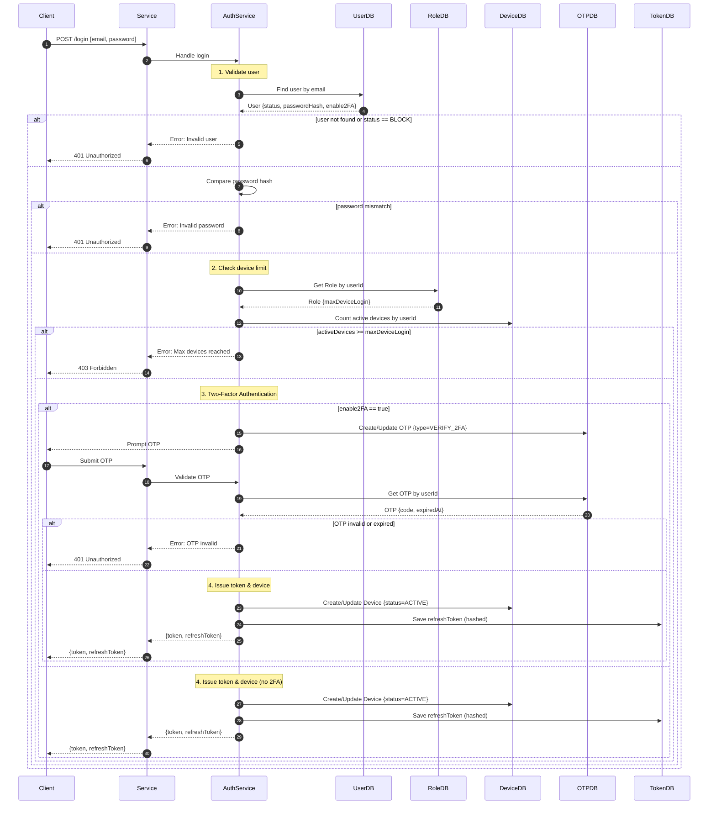

# Login Flow

---

### 1. Check user existence & status

- Query `User` by `email`.
- If user not found → throw `User not found`.
- If `status == BLOCK` → reject login with `User not found (blocked)`.

---

### 2. Validate password

- Compare `dto.password` with stored `hashPassword` using `hashingService.compare`.
- If invalid → throw `Invalid password`.

---

### 3. Check maximum device login limit

- Fetch `Role` of user → read `maxDeviceLogin`.
- Count devices with `status = ACTIVE`.
- If `activeDeviceCount >= maxDeviceLogin` → throw `Maximum device login reached`.

---

### 4. Check if 2FA is enabled

- If `enable2FA = true`:
  - Generate OTP (`type = VERIFY_2FA`).
  - Store or update OTP (`code`, `expiredAt`) for `userId`.
  - Send OTP via email.
  - Return `{ enable2FA: true, message: "enter OTP from your email" }`.
  - Client must call `POST /verify-otp` with `{ code }` before receiving tokens.

---

### 5. Create or update device record

- If 2FA is disabled:
  - Create/Update device with `userId`, `ip`, `userAgent`.
  - Mark `status = ACTIVE` and update `lastLogin`.

---

### 6. Generate tokens

- Create `accessToken` + `refreshToken` with payload `{ userId, deviceId }`.

---

### 7. Store refresh token

- Hash `refreshToken` value.
- Save or update record in `Token` collection with:
  - `userId`
  - `deviceId`
  - `refreshToken (hashed)`
  - `expiredAt`

---

### 8. Return response

- If 2FA disabled → return `{ enable2FA: false, data: { accessToken, refreshToken } }`.
- If 2FA enabled → return `{ enable2FA: true }` and wait for OTP verification.

---

## Sequence Diagram

