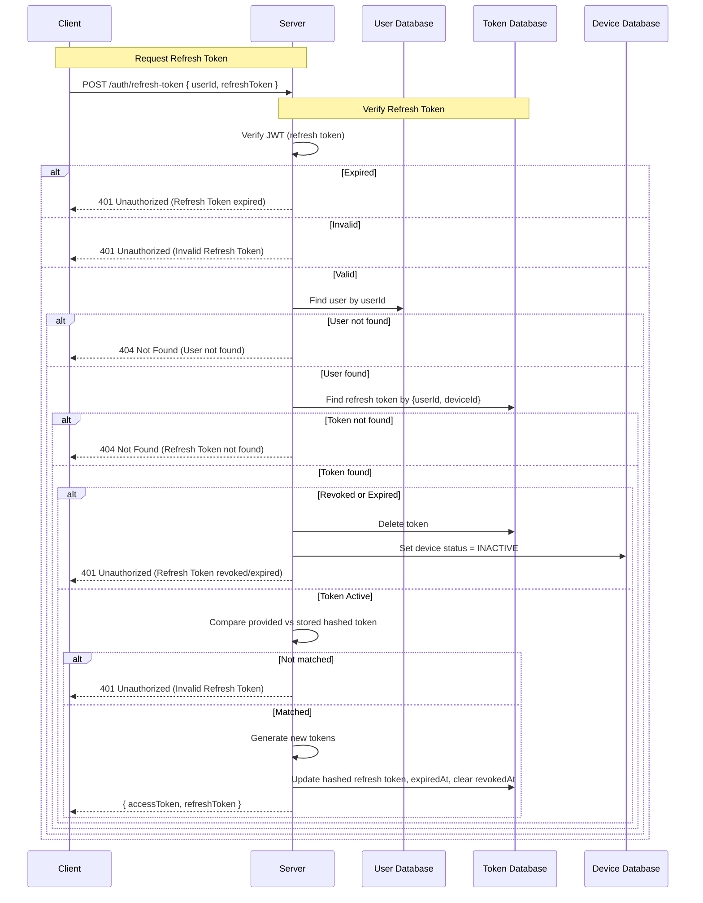

### Refresh Token Flow

- Client sends `{ refreshToken, userId }` to the server.

---

### Verify Refresh Token

- Verify the provided refresh token using JWT service.
- If `expired` → return **401 Unauthorized (Refresh Token expired)**.
- If `invalid` → return **401 Unauthorized (Invalid Refresh Token)**.
- If valid → extract `{ userId, deviceId }`.

---

### Validate User and Token in Database

- Fetch the user from `UserDB` by `userId`. If not found → **404 Not Found (User not found)**.
- Fetch the refresh token from `TokenDB` by `{ userId, deviceId }`. If not found → **404 Not Found (Refresh Token not found)**.
- If `revokedAt` exists or `expiredAt <= now` → delete token + set device to `INACTIVE` → return **401 Unauthorized (Refresh Token revoked/expired)**.
- Compare provided refresh token with stored hashed token. If mismatch → **401 Unauthorized (Invalid Refresh Token)**.

---

### Generate and Rotate Tokens

- Generate new access token and refresh token.
- Hash and replace the stored refresh token.
- Update `expiredAt` with a new expiry date and clear `revokedAt`.
- Return `{ accessToken, refreshToken }`.

---

### Sequence Diagram

