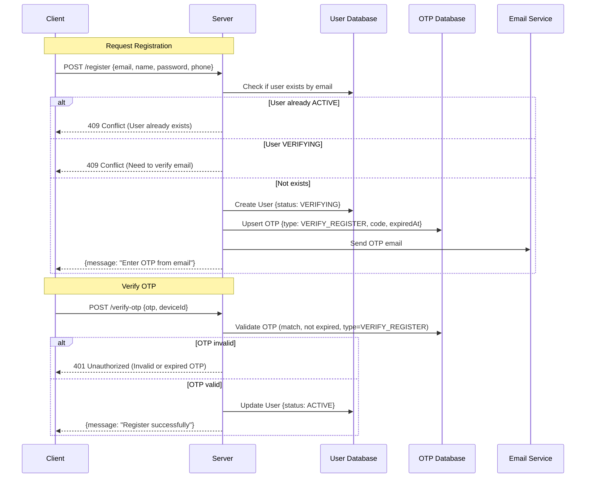

### Register

- Client sends `{ email, name, password, phone }` to the server.

---

### Validate Email

- Check if the email already exists in `UserDB`.
- If status = `VERIFYING` → return **409 Conflict (Need to verify email)**.
- If status = `ACTIVE` → return **409 Conflict (User already exists)**.

---

### Create User in VERIFYING Status

- Hash the password.
- Assign default role = `CLIENT`.
- Create a new User with `{ status: VERIFYING }`.

---

### Generate OTP for Registration

- Generate a numeric OTP code.
- Upsert OTP in `OtpDB` with `{ userId, type: VERIFY_REGISTER, code, expiredAt }`.

---

### Send OTP via Email

- Send OTP email to the user with `{ email, code, username, type, expiredAt }`.
- Return `{ message: "Enter OTP from email" }`.

---

### Verify OTP

- Client submits `{ otp, deviceId }` to the server.
- Server validates OTP:
  - Must match code.
  - Must not be expired.
  - Must have type = `VERIFY_REGISTER`.

- If valid → update User `{ status: ACTIVE }`.
- Return `{ message: "Register successfully" }`.

---

### Sequence Diagram

